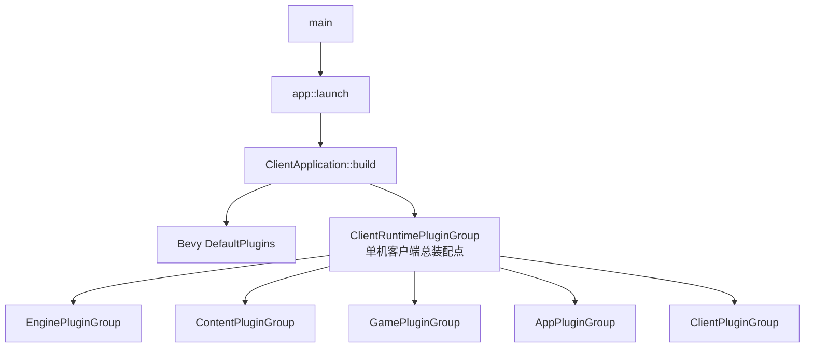
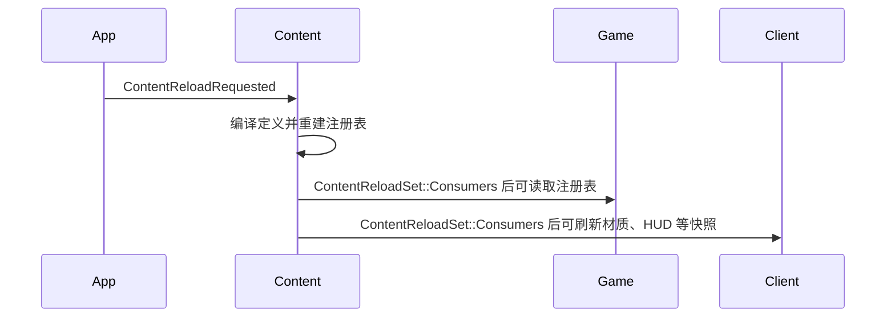
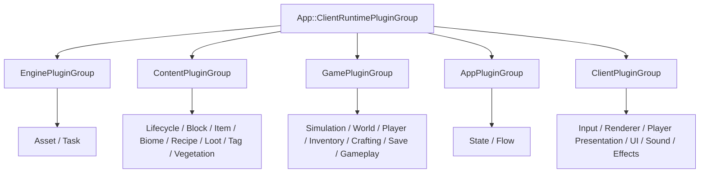

# 当前插件依赖图与分层重构路线

## 1. 目的与范围

本文档描述当前仓库中**实际参与客户端运行**的 Bevy 插件注册关系，并区分以下三个概念：

1. **插件注册关系**：哪个插件通过 `add_plugins` 注册了另一个插件。
2. **模块依赖关系**：哪个 Rust 层能够引用另一个层的类型和资源。
3. **系统调度关系**：系统在哪个 Bevy 调度阶段、哪个 `SystemSet` 中执行。

三者不能混为一谈。将插件分组能改善启动代码的可读性和运行模式复用，但不能自动保证 `FixedUpdate` 中的确定性顺序，也不能自动消除 Rust 模块的反向依赖。

本文只记录已存在源码；`ServerApplication`、`EditorApplication`、`server/`、`editor/` 和 `protocol/` 仍是规划边界，不能视为可运行的插件组合。

## 2. 当前入口与总装配点

正常启动路径如下：

```text
src/main.rs
  -> app::launch()
  -> ClientApplication::run(config)
  -> ClientApplication::build(config)
  -> Bevy DefaultPlugins + WorldStreamingConfig + ClientRuntimePluginGroup
  -> app.run()
```

`main.rs` 还提供 `--check-content` 工具模式。该模式直接调用内容校验，不会创建 Bevy 窗口或注册完整插件树。

当前单机客户端的总装配点是 `src/app/runtime.rs` 中的
`ClientRuntimePluginGroup`。它只按依赖顺序注册五个层级聚合插件；
`ClientPluginGroup` 已恢复为纯客户端表现入口，不再拥有 Game 或 Content。



`DefaultPlugins` 是 Bevy 提供的窗口、渲染、资产加载、输入等通用引擎插件；
它和项目的五个层级插件不是同一层概念。项目的 Engine 层只是本仓库封装的
可复用基础设施。

## 3. 当前完整注册树

下面的树按当前 `ClientRuntimePluginGroup` 的注册顺序列出。缩进表示由父插件
继续注册的嵌套插件；同一缩进中的顺序是插件注册顺序，不等于所有系统的帧内
执行顺序。

```text
ClientApplication
├─ Bevy DefaultPlugins
├─ WorldStreamingConfig 资源
└─ ClientRuntimePluginGroup                  当前总装配点
   ├─ EnginePluginGroup
   │  ├─ AssetPlugin
   │  └─ TaskPlugin
   │     └─ TaskRuntimePlugin
   ├─ ContentPluginGroup
   │  ├─ ContentLifecyclePlugin
   │  ├─ BiomeContentPlugin
   │  ├─ ItemContentPlugin
   │  ├─ VoxelPlugin
   │  ├─ LootPlugin
   │  ├─ TagContentPlugin
   │  ├─ RecipeContentPlugin
   │  └─ VegetationContentPlugin
   ├─ GamePluginGroup
   │  ├─ SimulationPlugin
   │  ├─ GameplayPlugin
   │  ├─ GameWorldPlugin
   │  │  ├─ WorldTimePlugin
   │  │  ├─ WorldStreamingPlugin
   │  │  ├─ WorldGenerationPlugin
   │  │  ├─ VegetationPlugin
   │  │  ├─ EntityPlugin
   │  │  │  └─ DroppedItemPlugin
   │  │  └─ WorldInteractionPlugin
   │  ├─ InventoryPlugin
   │  ├─ GamePlayerPlugin
   │  │  ├─ PlayerControlPlugin
   │  │  ├─ PlayerInteractionPlugin
   │  │  ├─ PlayerMovementPlugin
   │  │  ├─ PlayerPhysicsPlugin
   │  │  ├─ PlayerSurvivalPlugin
   │  │  ├─ PlayerLifecyclePlugin
   │  │  └─ PlayerCombatPlugin
   │  ├─ CraftingPlugin
   │  └─ GameSavePlugin
   │     ├─ WorldSavePlugin
   │     └─ PlayerSavePlugin
   ├─ AppPluginGroup
   │  └─ CorePlugin
   │     ├─ CoreStatePlugin
   │     └─ GameFlowPlugin
   └─ ClientPluginGroup
      ├─ ClientInputPlugin
      ├─ ClientRenderingPlugin
      ├─ ClientPlayerPlugin
      │  ├─ PlayerModelPlugin
      │  ├─ FullBodyFirstPersonPlugin
      │  └─ CameraPlugin
      ├─ ClientInterpolationPlugin
      ├─ ClientPresentationPlugin
      ├─ SkyPlugin
      ├─ UIPlugin
      │  ├─ HudPlugin
      │  ├─ UiWidgetsPlugin
      │  ├─ UiInteractionPlugin
      │  └─ UiScreensPlugin
      ├─ ClientSoundPlugin
      ├─ ClientParticlePlugin
      └─ ClientEffectPlugin
```

性能场景不是常规树的一部分。`ClientApplication::build` 会调用 `configure_fixed_performance_scenario`；只有设置 `CJ_PERF_SCENARIO` 环境变量后，它才额外注册 Bevy 诊断插件和性能场景系统。

## 4. 各层当前职责与插件

### 4.1 Engine

| 插件 | 当前职责 | 主要调度/资源 |
|---|---|---|
| `AssetPlugin` | 初始化项目资产管理器，同步纹理元数据。 | `AssetManager`，`PostUpdate` |
| `TaskPlugin` | 初始化项目任务管理器。 | `TaskManager` |
| `TaskRuntimePlugin` | 维护任务运行时上下文和统计。 | `RuntimeContext`，`PostUpdate` |

Engine 不应知道方块、玩家、世界、HUD 或运行模式。它可被 Content、Game、Client 和未来的 Server 复用。

### 4.2 Content

`ContentLifecyclePlugin` 是内容加载的调度中心。它在 `AppState::Loading` 时编译内容，并在 `AppState::InGame` 时定义以下顺序：

```text
ContentReloadSet::Request
  -> ContentReloadSet::Load
  -> ContentReloadSet::Consumers
```

其余内容插件建立或刷新各类运行时注册表：

| 插件 | 拥有的内容类别 |
|---|---|
| `VoxelPlugin` | 方块注册表和方块交互消息。 |
| `BiomeContentPlugin` | 生物群系定义注册表。 |
| `ItemContentPlugin` | 物品定义、模型和纹理注册表。 |
| `RecipeContentPlugin` | 配方注册表。 |
| `LootPlugin` | 方块掉落表注册表。 |
| `TagContentPlugin` | 由方块、物品和标签定义编译出的运行时标签索引。 |
| `VegetationContentPlugin` | 树种定义及树苗方块到运行时树种的索引。 |

Content 只回答“游戏中有哪些定义及其静态属性”，不直接生成玩家、执行饥饿规则或创建渲染网格。

### 4.3 Game

| 插件 | 当前职责 |
|---|---|
| `SimulationPlugin` | 定义固定步 `SimulationSet` 顺序、确定性随机源和变换历史。 |
| `GameplayPlugin` | 管理游戏模式等基础玩法状态，并消费客户端转换后的玩法请求。 |
| `GameWorldPlugin` | 世界状态、区块流送、地形/结构生成、世界时间、树实例与植被生长、交互和掉落物子插件。 |
| `InventoryPlugin` | 背包容器、槽位交互、权威命令和物品丢弃请求。 |
| `CraftingPlugin` | 工作台交互、合成网格和容器行为。 |
| `GamePlayerPlugin` | 玩家命令、移动、重力、方块交互、生存、生命周期和战斗规则。 |
| `GameSavePlugin` | 独立组装玩家存档、世界存档、区块载荷迁移、备份恢复和异步写入队列。 |

`SimulationPlugin` 中的固定步顺序是：

```text
Clock -> Commands -> Movement -> Physics -> Targeting
      -> Interaction -> Environment -> Survival -> Combat -> Entities
```

这条顺序比插件注册顺序更直接地决定了同一模拟步内移动、饥饿、伤害和掉落物逻辑的先后关系。

### 4.4 App

| 插件 | 当前职责 |
|---|---|
| `CoreStatePlugin` | 初始化 `AppState`。 |
| `GameFlowPlugin` | 菜单、世界创建/选择、加载、暂停、设置、保存退出和内容重载请求。 |

`AppState` 的当前生命周期为：

```text
Boot -> Loading -> MainMenu -> WorldLoading -> InGame <-> Paused
```

App 应作为模式选择和装配层。当前 `GameFlowPlugin` 为完成世界加载与清理，会直接引用若干 Game 资源和 `MeshBuildChannel`；这属于现有实现的协调耦合，后续可以通过“世界会话重置/加载”消息逐步收窄，而不应在没有测试保护时贸然搬动。

### 4.5 Client

| 插件 | 当前职责 |
|---|---|
| `ClientInputPlugin` | 组装动作采集、界面命令、上下文解析、光标同步和指针生命周期模块。 |
| `ClientRenderingPlugin` | 方块纹理图集、区块网格任务、掉落物视觉和物品渲染缓存。 |
| `ClientPlayerPlugin` | 为 Game 创建的本地权威玩家附加相机、表现根和第一/第三人称可见性。 |
| `PlayerModelPlugin` | Client 内的玩家骨架、动画状态、姿态和动画标记。 |
| `FullBodyFirstPersonPlugin` | 真实身体第一人称下的手持物品表现。 |
| `CameraPlugin` | 镜头、视角切换和视觉镜头同步。 |
| `ClientInterpolationPlugin` | 使用固定步历史快照插值客户端表现。 |
| `ClientPresentationPlugin` | 将世界时间等权威读模型投影为连续客户端表现资源。 |
| `SkyPlugin` | 天空和日夜表现。 |
| `UIPlugin` | 只初始化跨 UI 子模块共享的资源和消息，并组装四个 UI 子插件。 |
| `HudPlugin` | 游戏内常驻 HUD 布局和状态同步。 |
| `UiWidgetsPlugin` | 通用控件主题、滚动、拖拽图标和框架资源。 |
| `UiInteractionPlugin` | 把槽位和分类操作转换为 Game 命令。 |
| `UiScreensPlugin` | 菜单、背包、合成、死亡屏幕及其生命周期。 |
| `ClientSoundPlugin` | 环境、UI、方块和交互声音。 |
| `ClientParticlePlugin` / `ClientEffectPlugin` | 粒子、受击反馈、镜头效果、挖掘裂纹等表现。 |

Client 可以读取 Game、Content 和 Shared 的数据，但不应成为权威世界规则的所有者。

## 5. 内容重载的跨层数据流

内容加载是一个已明确使用消息和系统集表达跨层契约的案例：



更准确地说，App 发的是消息；Game 和 Client 不是被 Content 直接调用，而是在同一 `OnEnter(AppState::InGame)` 调度中，通过 `ContentReloadSet::Consumers` 在注册表更新后自行运行。这种方式保持了层级间的单向依赖。

## 6. 当前已经落实的边界

本轮结构整理已经完成以下关键迁移：

1. **总装配回到 App。** `ClientRuntimePluginGroup` 位于 App 层，Client 不再注册其他层。
2. **玩家权威与表现分离。** `GamePlayerPlugin` 由 `GamePluginGroup` 直接注册；
   `ClientPlayerPlugin` 只在 `PlayerStartupSet::Authority` 后附加骨架、相机和表现根。
3. **玩家模型归 Client。** 骨架、动画姿态、调试网格和手持锚点位于
   `client/player/model`，Game 不依赖这些表现类型。
4. **存档成为独立 Game 领域。** `GameSavePlugin` 与世界、玩家同级，分别组装
   玩家和世界存档，不再隐藏在世界插件中。
5. **UI 按职责分层。** `UIPlugin` 只拥有共享资源；HUD、通用控件、交互转换和
   完整屏幕由四个子插件分别注册。
6. **输入边界收窄。** Client 读取键盘鼠标并产生动作、游戏模式或存档调试请求；
   Game 的固定步系统不直接读取本机输入设备。Client 内部再按 `actions`、
   `interface`、`context`、`cursor` 和 `pointer` 拆分职责。
7. **时间职责分离。** Game 在 `FixedUpdate` 推进权威时钟和日历；Client 在渲染帧
   插值视觉时间并驱动天空表现。

仍需长期关注的协调点是 `GameFlowPlugin`：它负责跨层世界会话进入与退出，因而
会同时触发 Content、Game 和 Client 的生命周期。新增清理逻辑时应优先扩展窄消息
和各层消费者，不把具体区块、网格或 UI 算法继续堆入 App。

## 7. 当前聚合结构

每个已经拥有多个领域插件的层都有一个有意义的总入口：

```text
app/runtime.rs            ClientRuntimePluginGroup：单机客户端总装配
app/plugin_group.rs       AppPluginGroup：AppState、菜单和流程

engine/plugin_group.rs    EnginePluginGroup
content/plugin_group.rs   ContentPluginGroup
game/plugin_group.rs      GamePluginGroup
client/plugin_group.rs    ClientPluginGroup：只注册 Client 表现插件
```

当前装配图：



`ClientApplication::build` 只表达“创建 Bevy 应用、配置窗口和资产路径、插入运行
配置、注册客户端运行时插件组”。方块、背包、HUD 和玩家子插件由各层内部组装。

当前结构必须继续坚持两条边界：

- `GamePluginGroup` 直接注册 `GamePlayerPlugin`，Client 不得再次注册权威玩家规则。
- `ClientPlayerPlugin` 只负责本地相机、玩家表现根、骨架/动画绑定和第一人称可见性；
  权威玩家实体由 Game 创建，并可在无窗口运行时独立装配。

## 8. 后续修改顺序

后续增加领域或继续拆分模块时，按以下顺序降低回归风险：

1. 先确定数据、规则、表现和装配的真实所有者，再创建模块。
2. 先移动类型并保持公开路径兼容，再单独调整系统调度或行为。
3. Game 需要本机操作时，先在 Client 转换为动作或请求消息。
4. 新游戏规则进入 `FixedUpdate` 的明确 `SimulationSet`；纯表现留在渲染帧。
5. 更新插件图和结构文档，并运行架构边界测试。
6. 最后执行完整编译、测试、严格 Clippy 和必要的手动游戏流程验证。

## 9. 验收标准

每一步插件重构完成后，至少应验证：

```text
cargo fmt --all -- --check
cargo check --locked --all-targets --all-features
cargo test --locked
cargo clippy --locked --all-targets --all-features -- -D warnings
cargo run --locked -- --check-content assets
```

另外需要手动验证：能打开窗口、进入主菜单、创建或加载世界、进入世界、加载区块、移动玩家、打开背包、暂停并保存退出。插件分组重构通常不会改变玩法结果；若这些行为发生变化，说明迁移错误地改变了资源初始化、消息注册或系统调度。

## 10. 阅读建议

接手时先沿第 3 节的树阅读，不要一次打开所有插件实现。推荐顺序为：

```text
ClientApplication
  -> ClientRuntimePluginGroup
  -> 各层 PluginGroup
  -> ContentLifecyclePlugin
  -> SimulationPlugin
  -> GameWorldPlugin / GamePlayerPlugin / GameSavePlugin
  -> GameFlowPlugin
  -> ClientInputPlugin / ClientRenderingPlugin / ClientPlayerPlugin / UIPlugin
```

每读一个插件，记录它：初始化了什么资源、注册了什么消息、系统在哪个调度阶段运行、依赖哪些上游注册表或资源。这样才能区分“注册顺序问题”“资源所有权问题”和“具体玩法实现问题”。
